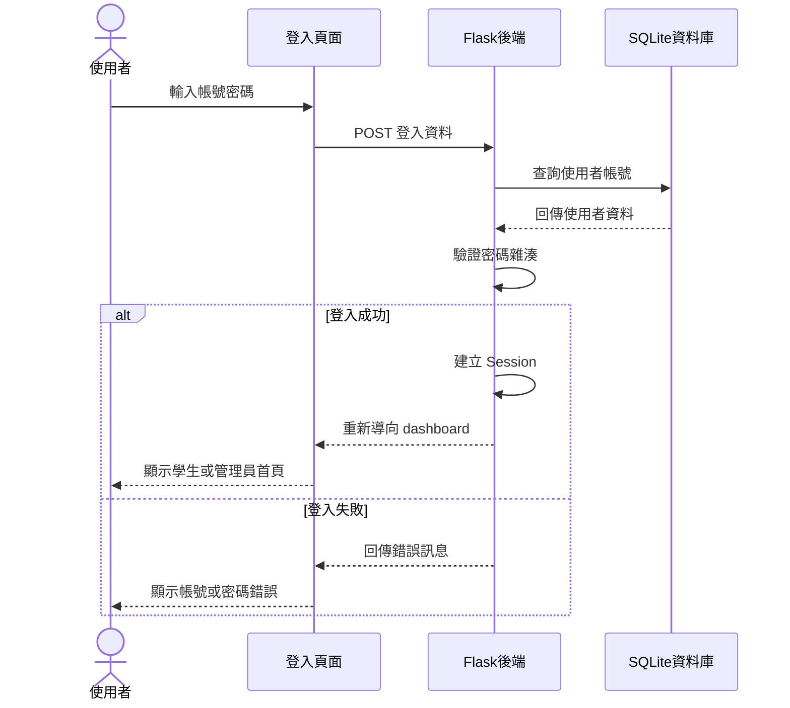

# US-17 登入功能循序圖

```mermaid
sequenceDiagram
    actor User as 使用者
    participant Web as 登入頁面
    participant Flask as Flask後端
    participant DB as SQLite資料庫

    User->>Web: 輸入帳號密碼
    Web->>Flask: POST 登入資料
    Flask->>DB: 查詢使用者帳號
    DB-->>Flask: 回傳使用者資料
    Flask->>Flask: 驗證密碼雜湊

    alt 登入成功
        Flask->>Flask: 建立 Session
        Flask-->>Web: 重新導向 dashboard
        Web-->>User: 顯示學生或管理員首頁
    else 登入失敗
        Flask-->>Web: 回傳錯誤訊息
        Web-->>User: 顯示帳號或密碼錯誤
    end
```
