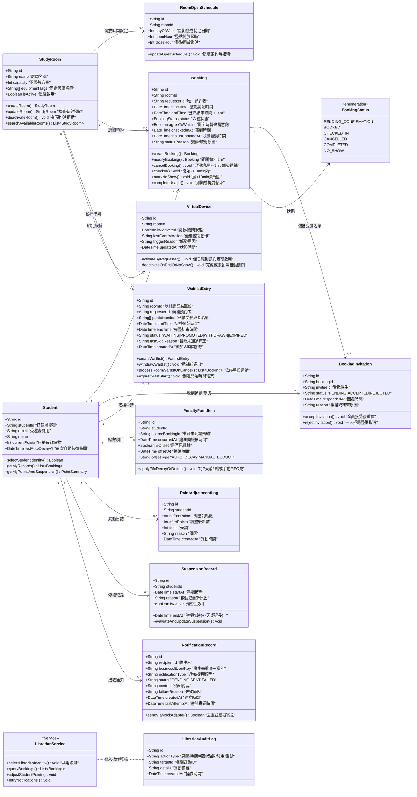

# 瀑布組 UML 類別圖（人工更改）

> 依據 `waterfall/SRS.md` (v0.1) 建模，採用由左至右（LR）排版並精簡方法參數簽章以優化版面寬度。

```mermaid
classDiagram
    direction LR

    class Student {
        +String id
        +String studentId "已建檔學號"
        +String email "受邀查詢用"
        +String name
        +Int currentPoints "目前有效點數"
        +DateTime lastAutoDecayAt "前次自動恢復時間"
        +selectStudentIdentity() Boolean
        +getMyRecords() List~Booking~
        +getMyPointsAndSuspension() PointSummary
    }

    class LibrarianService {
        <<Service>>
        +selectLibrarianIdentity() void "共用館員"
        +queryBookings() List~Booking~
        +adjustStudentPoints() void
        +retryNotifications() void
    }

    class StudyRoom {
        +String id
        +String name "房間名稱"
        +Int capacity "正整數容量"
        +String[] equipmentTags "固定設備標籤"
        +Boolean isActive "是否啟用"
        +createRoom() StudyRoom
        +updateRoom() StudyRoom "檢查有效預約"
        +deactivateRoom() void "有預約時拒絕"
        +searchAvailableRooms() List~StudyRoom~
    }

    class RoomOpenSchedule {
        +String id
        +String roomId
        +Int dayOfWeek "星期幾或特定日期"
        +Int openHour "整點開放起時"
        +Int closeHour "整點開放迄時"
        +updateOpenSchedule() void "破壞預約時拒絕"
    }

    class Booking {
        +String id
        +String roomId
        +String requesterId "唯一預約者"
        +DateTime startTime "整點開始時間"
        +DateTime endTime "整點結束時間 1~4hr"
        +BookingStatus status "六種狀態"
        +Boolean agreeToWaitlist "衝突時轉候補意向"
        +DateTime checkedInAt "報到時間"
        +DateTime statusUpdatedAt "狀態變動時間"
        +String statusReason "變動/取消原因"
        +createBooking() Booking
        +modifyBooking() Booking "距開始>=3hr"
        +cancelBooking() void "已預約須>=3hr; 觸發遞補"
        +checkIn() void "開始~+10min內"
        +markNoShow() void "逾+10min未報到"
        +completeUsage() void "到期或提前結束"
    }

    class BookingStatus {
        <<enumeration>>
        PENDING_CONFIRMATION
        BOOKED
        CHECKED_IN
        CANCELLED
        COMPLETED
        NO_SHOW
    }

    class BookingInvitation {
        +String id
        +String bookingId
        +String inviteeId "受邀學生"
        +String status "PENDING|ACCEPTED|REJECTED"
        +DateTime respondedAt "回覆時間"
        +String reason "拒絕或結束原因"
        +acceptInvitation() void "全員接受後重驗"
        +rejectInvitation() void "一人拒絕整筆取消"
    }

    class WaitlistEntry {
        +String id
        +String roomId "以討論室為單位"
        +String requesterId "候補預約者"
        +String[] participantIds "已接受參與者名單"
        +DateTime startTime "完整開始時間"
        +DateTime endTime "完整結束時間"
        +String status "WAITING|PROMOTED|WITHDRAWN|EXPIRED"
        +String lastSkipReason "暫時未通過原因"
        +DateTime createdAt "依加入時間排序"
        +createWaitlist() WaitlistEntry
        +withdrawWaitlist() void "遞補前退出"
        +processRoomWaitlistOnCancel() List~Booking~ "依序整段遞補"
        +expireIfPastStart() void "到達開始時間結案"
    }

    class PenaltyPointItem {
        +String id
        +String studentId
        +String sourceBookingId "來源未到場預約"
        +DateTime occurredAt "處理伺服器時間"
        +Boolean isOffset "是否已抵銷"
        +DateTime offsetAt "抵銷時間"
        +String offsetType "AUTO_DECAY|MANUAL_DEDUCT"
        +applyFifoDecayOrDeduct() void "每7天消1點或手動FIFO減"
    }

    class PointAdjustmentLog {
        +String id
        +String studentId
        +Int beforePoints "調整前點數"
        +Int afterPoints "調整後點數"
        +Int delta "差額"
        +String reason "原因"
        +DateTime createdAt "異動時間"
    }

    class SuspensionRecord {
        +String id
        +String studentId
        +DateTime startAt "停權起時"
        +DateTime endAt "停權迄時 (+7天或延長)"
        +String reason "啟動或更新原因"
        +Boolean isActive "是否生效中"
        +evaluateAndUpdateSuspension() void
    }

    class NotificationRecord {
        +String id
        +String recipientId "收件人"
        +String businessEventKey "事件去重唯一識別"
        +String notificationType "通知/提醒類型"
        +String status "PENDING|SENT|FAILED"
        +String content "通知內容"
        +String failureReason "失敗原因"
        +DateTime createdAt "建立時間"
        +DateTime lastAttemptAt "嘗試寄送時間"
        +sendViaMockAdapter() Boolean "去重並模擬寄送"
    }

    class VirtualDevice {
        +String id
        +String roomId
        +Boolean isActivated "開啟/關閉狀態"
        +String lastControlAction "最後控制動作"
        +String triggerReason "觸發原因"
        +DateTime updatedAt "狀態時間"
        +activateByRequester() void "僅已報到預約者可啟用"
        +deactivateOnEndOrNoShow() void "完成或未到場自動關閉"
    }

    class LibrarianAuditLog {
        +String id
        +String actionType "房間/時間/報到/點數/結束/重試"
        +String targetId "相關對象ID"
        +String details "異動摘要"
        +DateTime createdAt "操作時間"
    }

    %% 關聯定義
    Student "1" --> "0..*" Booking : 預約者
    Student "1" --> "0..*" BookingInvitation : 收到邀請/參與
    Student "1" --> "0..*" WaitlistEntry : 候補申請
    Student "1" --> "0..*" PenaltyPointItem : 點數項目
    Student "1" --> "0..*" PointAdjustmentLog : 異動日誌
    Student "1" --> "0..*" SuspensionRecord : 停權紀錄
    Student "1" --> "0..*" NotificationRecord : 接收通知

    StudyRoom "1" --> "0..*" RoomOpenSchedule : 開放時間設定
    StudyRoom "1" --> "0..*" Booking : 房間預約
    StudyRoom "1" --> "0..*" WaitlistEntry : 候補佇列
    StudyRoom "1" --> "1..*" VirtualDevice : 綁定設備

    Booking "1" --> "0..*" BookingInvitation : 包含受邀名單
    Booking --> BookingStatus : 狀態
    LibrarianService ..> LibrarianAuditLog : 寫入操作稽核
```
