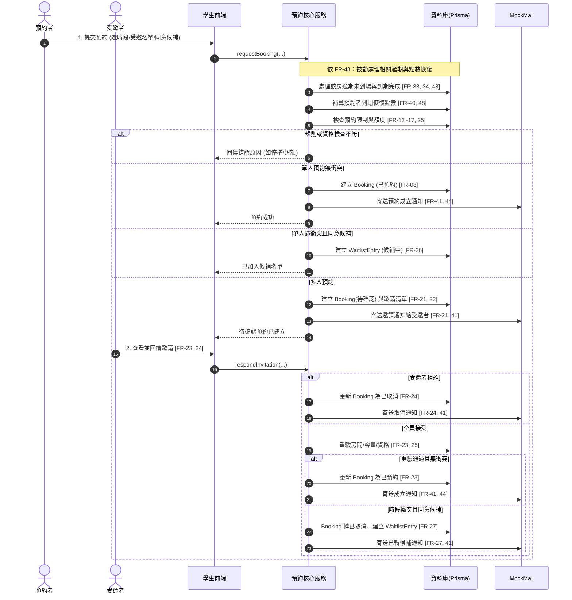
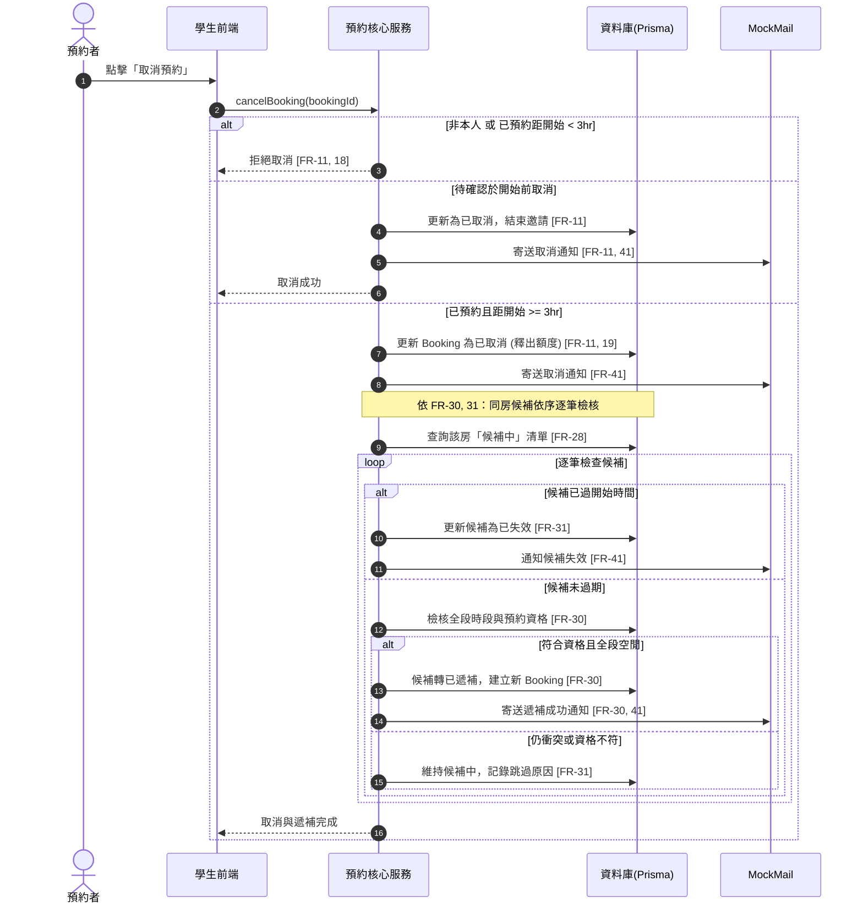
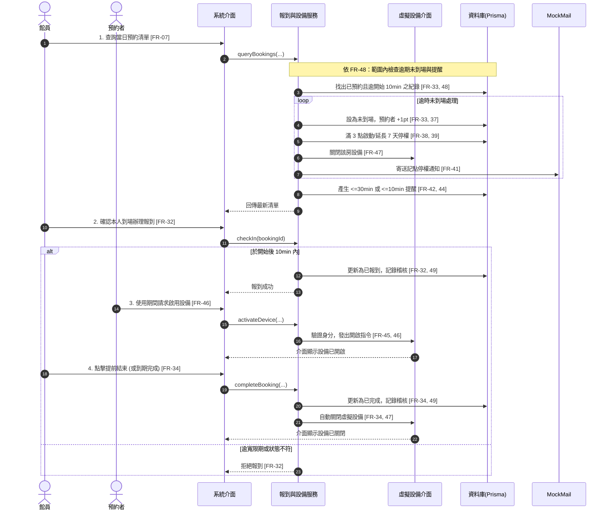

# 瀑布組 UML 循序圖

> 依據 `waterfall/SRS.md` 核心流程繪製，涵蓋被動關聯觸發（FR-48）與通知去重（FR-44）。

---

## 1. 預約與多人邀請／候補循序圖

```mermaid
sequenceDiagram
    autonumber
    actor 預約者
    actor 受邀者
    participant 前端 as 學生前端
    participant 服務端 as 預約核心服務
    participant DB as 資料庫(Prisma)
    participant Mail as MockMail

    預約者->>前端: 1. 提交預約 (選時段/受邀名單/同意候補)
    前端->>服務端: requestBooking(...)
    
    Note over 服務端,DB: 依 FR-48：被動處理相關逾期與點數恢復
    服務端->>DB: 處理該房逾期未到場與到期完成 [FR-33, 34, 48]
    服務端->>DB: 補算預約者到期恢復點數 [FR-40, 48]
    服務端->>DB: 檢查預約限制與額度 [FR-12~17, 25]
    
    alt 規則或資格檢查不符
        服務端-->>前端: 回傳錯誤原因 (如停權/超額)
    else 單人預約無衝突
        服務端->>DB: 建立 Booking (已預約) [FR-08]
        服務端->>Mail: 寄送預約成立通知 [FR-41, 44]
        服務端-->>前端: 預約成功
    else 單人遇衝突且同意候補
        服務端->>DB: 建立 WaitlistEntry (候補中) [FR-26]
        服務端-->>前端: 已加入候補名單
    else 多人預約
        服務端->>DB: 建立 Booking(待確認) 與邀請清單 [FR-21, 22]
        服務端->>Mail: 寄送邀請通知給受邀者 [FR-21, 41]
        服務端-->>前端: 待確認預約已建立
        
        受邀者->>前端: 2. 查看並回覆邀請 [FR-23, 24]
        前端->>服務端: respondInvitation(...)
        alt 受邀者拒絕
            服務端->>DB: 更新 Booking 為已取消 [FR-24]
            服務端->>Mail: 寄送取消通知 [FR-24, 41]
        else 全員接受
            服務端->>DB: 重驗房間/容量/資格 [FR-23, 25]
            alt 重驗通過且無衝突
                服務端->>DB: 更新 Booking 為已預約 [FR-23]
                服務端->>Mail: 寄送成立通知 [FR-41, 44]
            else 時段衝突且同意候補
                服務端->>DB: Booking 轉已取消，建立 WaitlistEntry [FR-27]
                服務端->>Mail: 寄送已轉候補通知 [FR-27, 41]
            end
        end
    end
```

---

## 2. 取消預約與候補自動遞補循序圖

```mermaid
sequenceDiagram
    autonumber
    actor 預約者
    participant 前端 as 學生前端
    participant 服務端 as 預約核心服務
    participant DB as 資料庫(Prisma)
    participant Mail as MockMail

    預約者->>前端: 點擊「取消預約」
    前端->>服務端: cancelBooking(bookingId)

    alt 非本人 或 已預約距開始 < 3hr
        服務端-->>前端: 拒絕取消 [FR-11, 18]
    else 待確認於開始前取消
        服務端->>DB: 更新為已取消，結束邀請 [FR-11]
        服務端->>Mail: 寄送取消通知 [FR-11, 41]
        服務端-->>前端: 取消成功
    else 已預約且距開始 >= 3hr
        服務端->>DB: 更新 Booking 為已取消 (釋出額度) [FR-11, 19]
        服務端->>Mail: 寄送取消通知 [FR-41]
        
        Note over 服務端,DB: 依 FR-30, 31：同房候補依序逐筆檢核
        服務端->>DB: 查詢該房「候補中」清單 [FR-28]
        loop 逐筆檢查候補
            alt 候補已過開始時間
                服務端->>DB: 更新候補為已失效 [FR-31]
                服務端->>Mail: 通知候補失效 [FR-41]
            else 候補未過期
                服務端->>DB: 檢核全段時段與預約資格 [FR-30]
                alt 符合資格且全段空閒
                    服務端->>DB: 候補轉已遞補，建立新 Booking [FR-30]
                    服務端->>Mail: 寄送遞補成功通知 [FR-30, 41]
                else 仍衝突或資格不符
                    服務端->>DB: 維持候補中，記錄跳過原因 [FR-31]
                end
            end
        end
        服務端-->>前端: 取消與遞補完成
    end
```

---

## 3. 館員報到、未到場記點與虛擬設備控制循序圖

```mermaid
sequenceDiagram
    autonumber
    actor 館員
    actor 預約者
    participant 介面 as 系統介面
    participant 服務端 as 報到與設備服務
    participant 設備 as 虛擬設備介面
    participant DB as 資料庫(Prisma)
    participant Mail as MockMail

    館員->>介面: 1. 查詢當日預約清單 [FR-07]
    介面->>服務端: queryBookings(...)
    
    Note over 服務端,DB: 依 FR-48：範圍內檢查逾期未到場與提醒
    服務端->>DB: 找出已預約且逾開始 10min 之紀錄 [FR-33, 48]
    loop 逾時未到場處理
        服務端->>DB: 設為未到場，預約者 +1pt [FR-33, 37]
        服務端->>DB: 滿 3 點啟動/延長 7 天停權 [FR-38, 39]
        服務端->>設備: 關閉該房設備 [FR-47]
        服務端->>Mail: 寄送記點停權通知 [FR-41]
    end
    服務端->>DB: 產生 <=30min 或 <=10min 提醒 [FR-42, 44]
    服務端-->>介面: 回傳最新清單

    館員->>介面: 2. 確認本人到場辦理報到 [FR-32]
    介面->>服務端: checkIn(bookingId)
    alt 於開始後 10min 內
        服務端->>DB: 更新為已報到，記錄稽核 [FR-32, 49]
        服務端-->>介面: 報到成功
        
        預約者->>介面: 3. 使用期間請求啟用設備 [FR-46]
        介面->>服務端: activateDevice(...)
        服務端->>設備: 驗證身分，發出開啟指令 [FR-45, 46]
        設備-->>介面: 介面顯示設備已開啟
        
        館員->>介面: 4. 點擊提前結束 (或到期完成) [FR-34]
        介面->>服務端: completeBooking(...)
        服務端->>DB: 更新為已完成，記錄稽核 [FR-34, 49]
        服務端->>設備: 自動關閉虛擬設備 [FR-34, 47]
        設備-->>介面: 介面顯示設備已關閉
    else 逾寬限期或狀態不符
        服務端-->>介面: 拒絕報到 [FR-32]
    end
```
