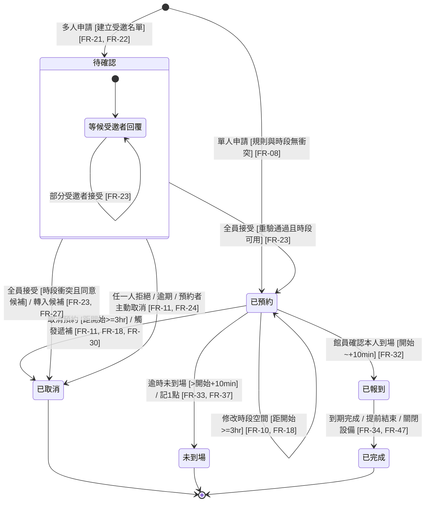
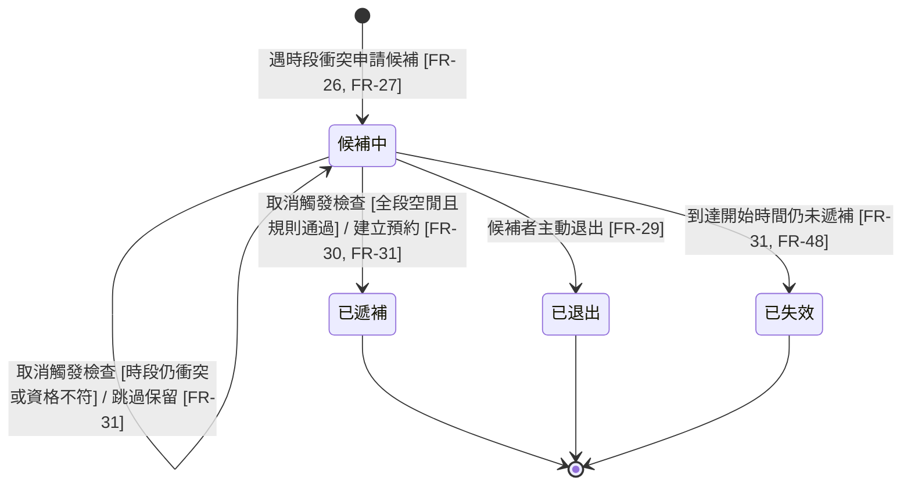

# 瀑布組 UML 狀態圖

> 依據 `waterfall/SRS.md` 5.3 節與 5.4 節，系統包含「正式預約／邀請狀態」與「獨立候補狀態」，依 UML 規範標註事件、條件與動作代碼。

---

## 1. 正式預約／邀請申請狀態圖（對應 FR-20、5.3 節）

```mermaid
stateDiagram-v2
    [*] --> 已預約 : 單人申請 [規則與時段無衝突] [FR-08]
    [*] --> 待確認 : 多人申請 [建立受邀名單] [FR-21, FR-22]

    state 待確認 {
        [*] --> 等候受邀者回覆
        等候受邀者回覆 --> 等候受邀者回覆 : 部分受邀者接受 [FR-23]
    }

    待確認 --> 已預約 : 全員接受 [重驗通過且時段可用] [FR-23]
    待確認 --> 已取消 : 全員接受 [時段衝突且同意候補] / 轉入候補 [FR-23, FR-27]
    待確認 --> 已取消 : 任一人拒絕 / 逾期 / 預約者主動取消 [FR-11, FR-24]

    已預約 --> 已預約 : 修改時段空間 [距開始>=3hr] [FR-10, FR-18]
    已預約 --> 已取消 : 取消預約 [距開始>=3hr] / 觸發遞補 [FR-11, FR-18, FR-30]
    已預約 --> 已報到 : 館員確認本人到場 [開始~+10min] [FR-32]
    已預約 --> 未到場 : 逾時未到場 [>開始+10min] / 記1點 [FR-33, FR-37]

    已報到 --> 已完成 : 到期完成 / 提前結束 / 關閉設備 [FR-34, FR-47]

    已取消 --> [*]
    未到場 --> [*]
    已完成 --> [*]
```

---

## 2. 候補申請狀態圖（對應 FR-26～FR-31、5.4 節）

```mermaid
stateDiagram-v2
    [*] --> 候補中 : 遇時段衝突申請候補 [FR-26, FR-27]

    候補中 --> 候補中 : 取消觸發檢查 [時段仍衝突或資格不符] / 跳過保留 [FR-31]
    候補中 --> 已遞補 : 取消觸發檢查 [全段空閒且規則通過] / 建立預約 [FR-30, FR-31]
    候補中 --> 已退出 : 候補者主動退出 [FR-29]
    候補中 --> 已失效 : 到達開始時間仍未遞補 [FR-31, FR-48]

    已遞補 --> [*]
    已退出 --> [*]
    已失效 --> [*]
```
