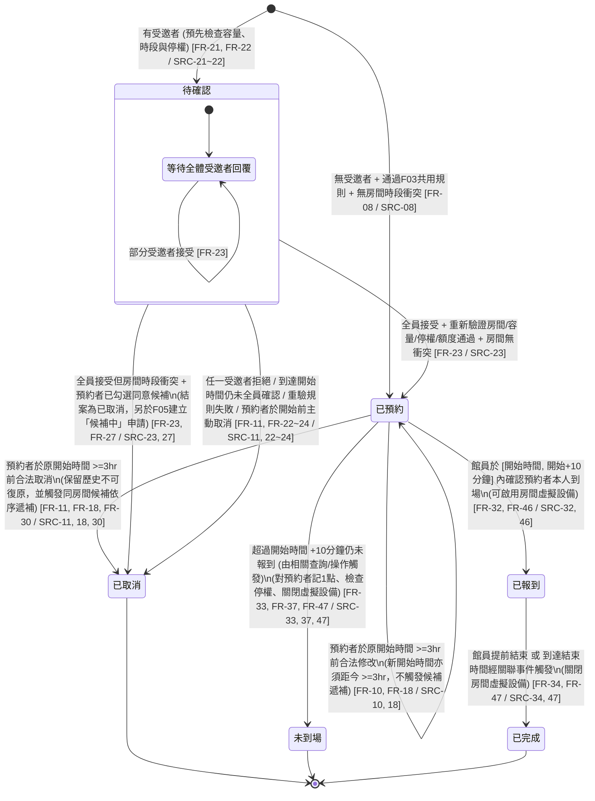
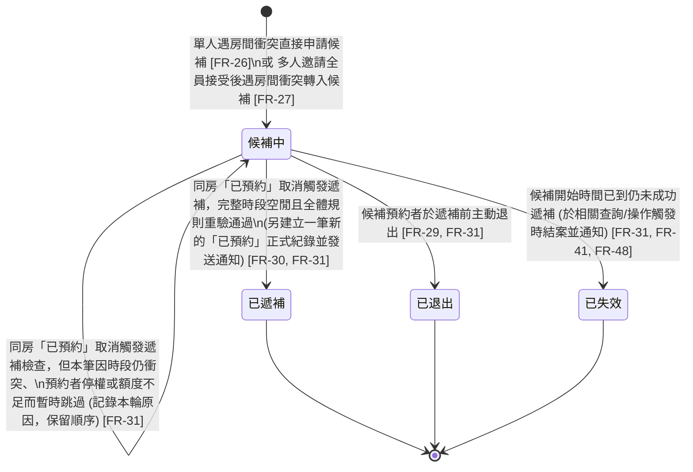

# Waterfall UML State Diagram
---

## 1. 正式預約／邀請申請狀態圖（對應 FR-20、5.3 節）

```mermaid
stateDiagram-v2
    [*] --> 已預約 : 無受邀者 + 通過F03共用規則 + 無房間時段衝突 [FR-08 / SRC-08]
    [*] --> 待確認 : 有受邀者 (預先檢查容量、時段與停權) [FR-21, FR-22 / SRC-21~22]

    state 待確認 {
        [*] --> 等待全體受邀者回覆
        等待全體受邀者回覆 --> 等待全體受邀者回覆 : 部分受邀者接受 [FR-23]
    }

    待確認 --> 已預約 : 全員接受 + 重新驗證房間/容量/停權/額度通過 + 房間無衝突 [FR-23 / SRC-23]
    待確認 --> 已取消 : 全員接受但房間時段衝突 + 預約者已勾選同意候補\n(結案為已取消，另於F05建立「候補中」申請) [FR-23, FR-27 / SRC-23, 27]
    待確認 --> 已取消 : 任一受邀者拒絕 / 到達開始時間仍未全員確認 / 重驗規則失敗 / 預約者於開始前主動取消 [FR-11, FR-22~24 / SRC-11, 22~24]

    已預約 --> 已預約 : 預約者於原開始時間 >=3hr 前合法修改\n(新開始時間亦須距今 >=3hr，不觸發候補遞補) [FR-10, FR-18 / SRC-10, 18]
    已預約 --> 已取消 : 預約者於原開始時間 >=3hr 前合法取消\n(保留歷史不可復原，並觸發同房間候補依序遞補) [FR-11, FR-18, FR-30 / SRC-11, 18, 30]
    已預約 --> 已報到 : 館員於 [開始時間, 開始+10分鐘] 內確認預約者本人到場\n(可啟用房間虛擬設備) [FR-32, FR-46 / SRC-32, 46]
    已預約 --> 未到場 : 超過開始時間 +10分鐘仍未報到 (由相關查詢/操作觸發)\n(對預約者記1點、檢查停權、關閉虛擬設備) [FR-33, FR-37, FR-47 / SRC-33, 37, 47]

    已報到 --> 已完成 : 館員提前結束 或 到達結束時間經關聯事件觸發\n(關閉房間虛擬設備) [FR-34, FR-47 / SRC-34, 47]

    已取消 --> [*]
    未到場 --> [*]
    已完成 --> [*]
```

---

## 2. 候補申請狀態圖（對應 FR-26～FR-31、5.4 節）

```mermaid
stateDiagram-v2
    [*] --> 候補中 : 單人遇房間衝突直接申請候補 [FR-26]\n或 多人邀請全員接受後遇房間衝突轉入候補 [FR-27]

    候補中 --> 候補中 : 同房「已預約」取消觸發遞補檢查，但本筆因時段仍衝突、\n預約者停權或額度不足而暫時跳過 (記錄本輪原因，保留順序) [FR-31]
    候補中 --> 已遞補 : 同房「已預約」取消觸發遞補，完整時段空閒且全體規則重驗通過\n(另建立一筆新的「已預約」正式紀錄並發送通知) [FR-30, FR-31]
    候補中 --> 已退出 : 候補預約者於遞補前主動退出 [FR-29, FR-31]
    候補中 --> 已失效 : 候補開始時間已到仍未成功遞補 (於相關查詢/操作觸發時結案並通知) [FR-31, FR-41, FR-48]

    已遞補 --> [*]
    已退出 --> [*]
    已失效 --> [*]
```